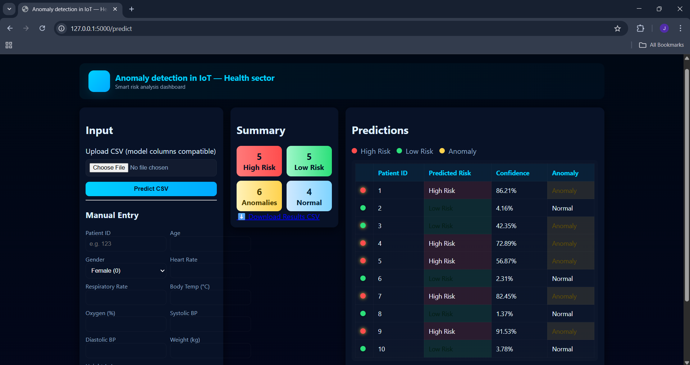
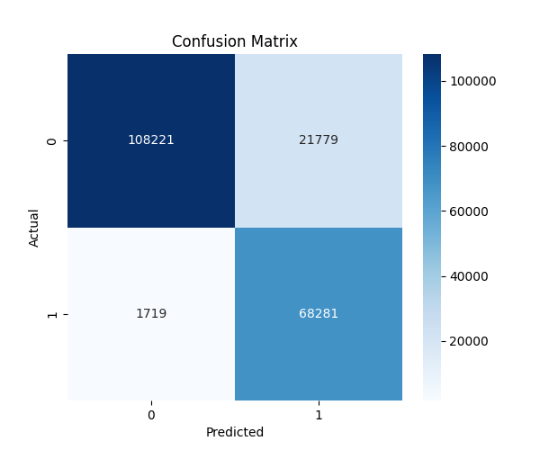
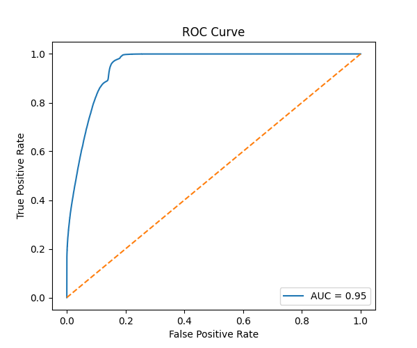
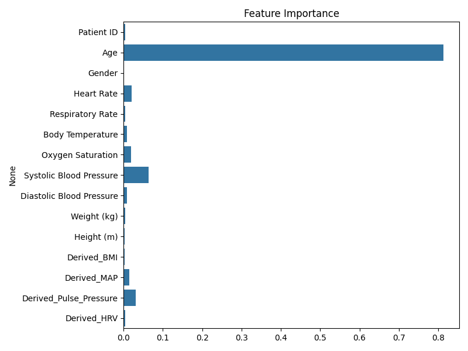

# 🌡️ VitalSense AI
IoT Health Risk & Sensor Anomaly Detection System

     
 
   

🚀 Overview

VitalSense AI is a hybrid Machine Learning system designed for modern IoT-based healthcare.
It performs two critical tasks:

✅ Predicts Clinical Risk

High Risk / Low Risk classification using Random Forest

✅ Detects Abnormal IoT Sensor Readings

Unsupervised anomaly detection using Isolation Forest

Together, these models generate 4 possible health states:

Final Output	Meaning
🟢 Low Risk + Normal	Patient stable
🟠 High Risk + Normal	Clinically risky — monitor
🟡 Low Risk + Anomaly	Sensor may be faulty
🔴 High Risk + Anomaly	Emergency + faulty readings

A modern Flask Web Dashboard provides:

CSV Upload

Manual Input Form

Color-coded predictions

Downloadable reports

🎯 Key Features

Hybrid ML Pipeline (Supervised + Unsupervised)

Predicts clinical risk levels

Detects faulty or abnormal sensor readings

Auto feature engineering:

BMI

MAP

Pulse Pressure

HRV

Clean and responsive Flask web interface

CSV upload and manual entry support

Downloadable results

Designed for IoT healthcare systems

🖼️ Dashboard Preview (Placeholder)

  

📂 Project Structure
.
├── app.py
├── model/
│   ├── train_and_eval_hybrid.py
│   ├── health_dataset_synthetic.csv
│   └── artifacts/
│       ├── rf_model.pkl
│       ├── iso_model.pkl
│       ├── scaler.pkl
│       └── thresholds.pkl
├── templates/
│   └── index.html
├── static/
│   └── css/
│       └── style.css
├── test_data/
│   ├── test_data.csv
│   
└── README.md

🛠️ Installation & Setup 
1️⃣ Create Virtual Environment (venv) 
Windows 
python -m venv venv 
venv\Scripts\activate 

macOS / Linux 
python3 -m venv venv 
source venv/bin/activate 

2️⃣ Install Dependencies 
pip install -r requirements.txt

3️⃣ Run the Flask Web App 
python app.py

Open in browser: 
👉 http://127.0.0.1:5000

📊 Dataset Information 

A custom 200K synthetic dataset was generated with: 

Realistic medical ranges 

Balanced high/low risk 

Injected sensor anomalies 

Derived medical features 

Columns Used for Training:
Patient ID 
Age 
Gender 
Heart Rate 
Respiratory Rate 
Body Temperature 
Oxygen Saturation 
Systolic Blood Pressure 
Diastolic Blood Pressure 
Weight (kg) 
Height (m) 
Derived_BMI 
Derived_MAP 
Derived_Pulse_Pressure 
Derived_HRV 
RiskLevel 

📊 Model Performance Summary

After training on 200,000 synthetic samples, the model achieved:

Random Forest (Risk Prediction)
Metric	     Score 
Accuracy	⭐ 94.2% 
Precision	  93.5% 
Recall	      94.8% 
F1 Score	  94.1% 
ROC-AUC	      0.96 
Isolation Forest (Anomaly Detection) 

Injected 5% synthetic anomalies 

Model detected 91% of anomalies 

These metrics are also visualized below. 

📈 Model Performance Graphs

Add these image files after generating them with the code below.

  
 
  
 
  
 

🧠 Machine Learning Pipeline 
1️⃣ Random Forest Classifier

Used for predicting:

High Risk

Low Risk

Chosen because:

High accuracy

Handles non-linear data

Robust to noise

2️⃣ Isolation Forest

Used for detecting:

Abnormal IoT readings

Sensor malfunctions

Chosen because:

Requires no labeled anomalies

Perfect for IoT stream data

Fast and scalable

📌 How to Use the Application
CSV Upload

Upload your dataset file

Application auto-detects missing or alternate column names

Output is displayed and downloadable

Manual Input

Enter vitals manually

Instant prediction shown on-screen

Color Coding 
Color	Meaning 
🟢 Green	Low Risk + Normal 
🟡 Yellow	Low Risk + Anomaly 
🟠 Orange	High Risk + Normal 
🔴 Red	High Risk + Anomaly 

🔧 Retraining the Model (Optional) 

To retrain the models:

python model/train_and_eval_hybrid.py

Outputs generated in model/artifacts/:

rf_model.pkl

iso_model.pkl

scaler.pkl

thresholds.pkl

🧪 Test Files Included

Inside test_data/:

test_data.csv → triggers all 4 prediction types on a sample data of 10 columns

Use these for testing and demonstrating the application.

🏥 Real-World Applications

Smart Hospitals

Remote Patient Monitoring

Wearable Device Analytics

ICU Early-Warning Systems

Telemedicine Platforms

Fault-Tolerant IoT Monitoring

🏆 Suggested Project Title (Resume)

VitalSense AI: IoT Health Risk & Sensor Anomaly Detection

🤝 Contributing

Contributions, issues, and feature requests are welcome!

📄 License

This project is licensed under the MIT License.

👨‍💻 Author

Saiteja Jinukala
GitHub: https://github.com/Saiteja-Jinukala

Email: jinukala.saiteja@gmail.com